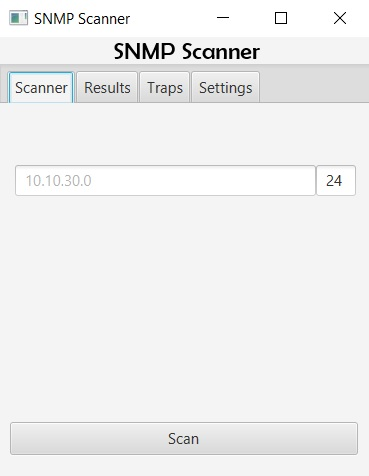

# SNMP Scanner
https://github.com/1TTO/SNMP-Scanner

##Description
This SNMP Scanner has the option to scan an address, a network or range. You can select if you prefer using 
get or getNext or if you want to scan the public or private community. You can add custom MIBs and OIDs and delete
them by double-clicking the label. In the Tab results you will see your scan results which will be deleted after
a new scan. By double-clicking on them you will see a detailed window containing the information gathered. In the tab Traps
you will see all traps that were captured since the start of the program. By double-clicking on the trap-label you
will be provided with a detailed view of the trap and its information.

## Installing:
Open your project in Intellij and run the command: maven package.
Make sure that in the folder of the artifact you put a folder named data with a mib.csv and oid.csv where
you insert your mibs and oids.
Execute your artifact in the command prompt with java -jar [Artifactname].
Make sure to use java 8 and having included it in the path-variables.

## Functionalities:
- Scan network with netmask
- Scan network range
- Scan single address
- Traps support
- Customize MIBs
- Customize OIDs
- Change Public/Private
- Change Get/GetNext
- Simple GUI with individual MIB and OID support

## ToDo:
- Nothing for the moment